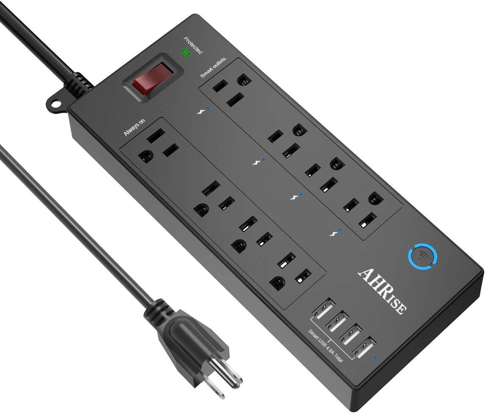

1. TOC
{:toc}

## Product Images



## GPIO Pinout

| Pin     | Function                           |
|---------|------------------------------------|
| GPIO04  | Status LED inverted                |
| GPIO05  | Push Button                        |
| GPIO12  | Relay 2 not inverted               |
| GPIO13  | Relay 1 not inverted               |
| GPIO14  | Relay 3 not inverted               |
| GPIO15  | Relay 4 not inverted               |

## Basic Configuration

```yaml
# Basic Config
---
substitutions:
  displayname: "AHRise Power Strip"
  unique_id: "ahrise_ahr-083"

esphome:
  name: ${unique_id}
  platform: ESP8266
  board: esp01_1m
  esp8266_restore_from_flash: true

# WiFi connection
wifi:
  ssid: !secret iot_wifi_ssid
  password: !secret iot_wifi_password
  power_save_mode: none
  fast_connect: true
  # Enable fallback hotspot (captive portal) in case wifi connection fails
  ap:
    ssid: "${displayname}"
    password: !secret ap_mode_password

captive_portal:

# Enable logging
logger:

# Enable Home Assistant API
api:
  password: !secret api_password
  reboot_timeout: 0s

text_sensor:
  - platform: wifi_info
    ip_address:
      name: "${displayname} IP Address"

ota:
  password: !secret ota_password

switch:
  - platform: gpio
    name: "${displayname} Relay 1"
    id: relay1
    pin:
      number: GPIO13
  - platform: gpio
    name: "${displayname} Relay 2"
    id: relay2
    pin:
      number: GPIO12
  - platform: gpio
    name: "${displayname} Relay 3"
    pin:
      number: GPIO14
    id: relay3
  - platform: gpio
    name: "${displayname} Relay 4"
    id: relay4
    pin:
      number: GPIO15
  - platform: restart
    name: "${displayname} Restart"

light:
# Blue LED PWM
# GPIO4
  - platform: monochromatic
    name: "${displayname} Blue LED"
    output: output_component_blue

output:
#Blue LED
  - platform: esp8266_pwm
    id: output_component_blue
    pin: GPIO4
    inverted: yes

# Button & Automation to toggle all switches
# GPIO5

binary_sensor:
  - platform: gpio
    pin: GPIO5
    id: button
    name: "${displayname} Button"
    on_press:
      - switch.toggle: relay1
      - switch.toggle: relay2
      - switch.toggle: relay3
      - switch.toggle: relay4
    internal: True

  # Binary sensor to display the connected status
  - platform: status
    name: "${displayname} Status"
```
