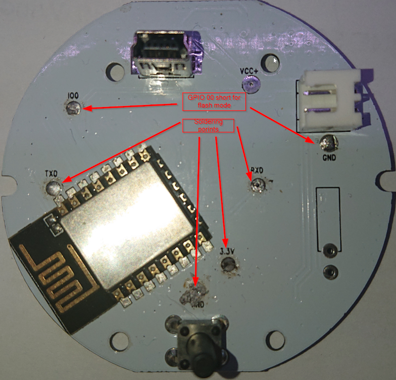

  
  
  

Model reference: Moonlamp

The moonlamp has both RGB and Cold / Warm white handled by three groups of three leds.

Manufacturer: [Zemismart](https://www.zemismart.com/products/christmas-gift-led-remote-control-light-compatible-with-alexa-google-home-3d-printing-children-bedroom-colorful-moon-lamp-app-121)

## How to flash

1. Open

   There are 3 screws securing the bottom to the 3D printed moon.
  
2. Unmount circuit from the box

   5 more screws, securing the diffuser to the print, and the print to the socket.

3. Pins

   There are pads for RX, TX, 3.3v, GND and I00 nicely marked on the board, ignore my mess with the solder, the GND is rather large and takes a lot of heat, and the solder I have at the moment is terrible, and I'm just waiting for something new to arrive.
   
   **REMEMBER to disconnect the battery and the USB power before flashing!!!!**
   
  

There is only 1 MB on the onboard esp8266, so the code has every thing 'extra' removed to keep it small, and being able to do OTA.
The WW and CW temperature values are unknown, so purely guesses.
